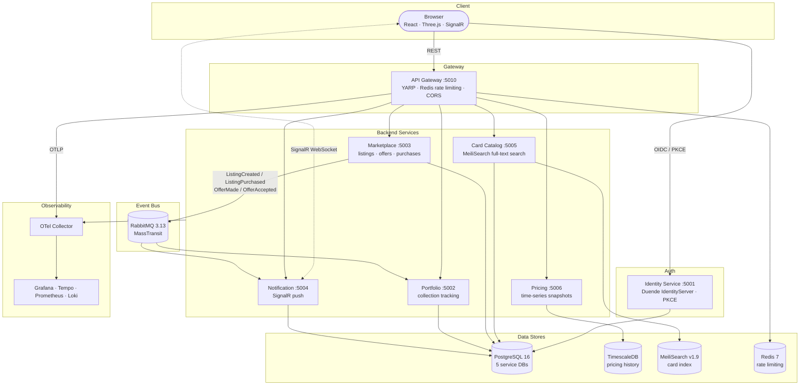

# Rollout TCG

A platform for tracking and trading physical Pokémon cards. Browse real cards from the TCGdex API, manage your collection, list cards for sale, and get notified when something sells or an offer comes in.

Live at **[rollout.wanony.dev](https://rollout.wanony.dev)**

---

## What it does

- **Card catalog** — browse and search Pokémon cards via [TCGdex](https://tcgdex.net). Filter by type, rarity, set, or artist. Infinite scroll. Click any card to see full details including real Cardmarket EUR and TCGplayer USD prices with a 30-day trend chart.
- **Portfolio** — track cards you own. Click an entry to pull up the full card detail. Remove cards when you sell them.
- **Marketplace** — list cards for sale, make offers, buy from others.
- **Notifications** — real-time push when something happens: offer received, listing sold, etc.
- **Auth** — login with OAuth2 (PKCE). Passwords are handled by the Identity Service — not stored anywhere in the app.

---

## Stack

| Layer | What |
|---|---|
| Backend | .NET 10 · ASP.NET Core Minimal APIs |
| Auth | Duende IdentityServer · ASP.NET Core Identity |
| Messaging | MassTransit + RabbitMQ |
| Databases | PostgreSQL (5 service DBs) · TimescaleDB (price history) |
| Search | MeiliSearch |
| Gateway | YARP reverse proxy + Redis rate limiting |
| Frontend | React 18 · TypeScript · Vite · Tailwind CSS |
| 3D / visual | Three.js + @react-three/fiber (holographic card tilt, dither background) |
| Animations | framer-motion |
| Data fetching | @tanstack/react-query |
| Real-time | @microsoft/signalr |
| Observability | OpenTelemetry · Serilog · Grafana (Tempo, Prometheus, Loki) |

---

## Architecture



Each service owns its own database and communicates with others via events over RabbitMQ — no direct service-to-service calls. The API Gateway is the only entry point for the frontend.

---

## Services

| Service | Port | What it does |
|---|---|---|
| **Identity** | 5001 | Login, registration, token issuance |
| **Portfolio** | 5002 | Add, track, and remove owned cards |
| **Marketplace** | 5003 | Listings, offers, purchases |
| **Notification** | 5004 | Persists notifications and pushes them in real time via SignalR |
| **Card Catalog** | 5005 | Card data + MeiliSearch-backed full-text search |
| **Pricing** | 5006 | Price snapshots stored in TimescaleDB |
| **API Gateway** | 5010 | Routes all frontend traffic, enforces rate limiting |

Each service follows the same internal layout:

```
src/<Service>/
  Domain/          # Entities and business rules
  Application/     # DTOs and repository interfaces
  Infrastructure/  # Database, messaging, search
  Program.cs       # API endpoints
```

> Pricing uses Dapper + raw SQL instead of EF Core — better fit for the append-only time-series writes into TimescaleDB.

---

## SharedKernel

A shared project (not a NuGet package) that all services reference.

**Domain primitives:** `Entity` (base with `Id` + `CreatedAt`), `AggregateRoot` (adds domain events), `IDomainEvent` marker.

**Integration events** — who publishes what and who listens:

| Event | Publisher | Consumers |
|---|---|---|
| `ListingCreatedEvent` | Marketplace | Notification |
| `ListingPurchasedEvent` | Marketplace | Notification, Portfolio |
| `OfferMadeEvent` | Marketplace | Notification |
| `OfferAcceptedEvent` | Marketplace | Notification |

**Infrastructure helpers:** `AddTelemetry(serviceName)` wires Serilog → Loki, traces → Tempo, and Prometheus in one call. Used in every service.

---

## Quick start

**You need:** Docker Desktop and the .NET 10 SDK.

```bash
# Start everything
docker compose up -d

# Optional: add Grafana, Tempo, Prometheus, Loki
docker compose --profile observability up -d

# Check everything came up
docker compose ps
```

### URLs

| URL | What |
|---|---|
| **http://localhost** | The app |
| http://localhost:3001 | Grafana (observability profile) |
| http://localhost:15672 | RabbitMQ management UI (`guest` / `guest`) |
| http://localhost:7700 | MeiliSearch |
| http://localhost:5001 | Identity Service |
| http://localhost:5010 | API Gateway |

**Demo account:** `demo@rollout.dev` / `Demo1234!`

---

## Development

```bash
# Build everything
dotnet build TCGTrading.sln

# Run tests (Testcontainers spins up real Postgres, RabbitMQ, Redis, MeiliSearch)
dotnet test TCGTrading.sln

# Run a single service
dotnet run --project src/Marketplace

# Frontend dev server
cd src/Frontend && npm install && npm run dev

# Docs site
pip install -r requirements.txt
mkdocs serve   # live preview at http://127.0.0.1:8000
```

---

## CI / CD

| Workflow | When | What |
|---|---|---|
| `ci.yml` | Every push and PR to main | Build + test the full solution |
| `docker.yml` | Push to main | Build all 7 service images and push to GHCR |
| `docs.yml` | Push to main (docs files) | Deploy docs to GitHub Pages |
