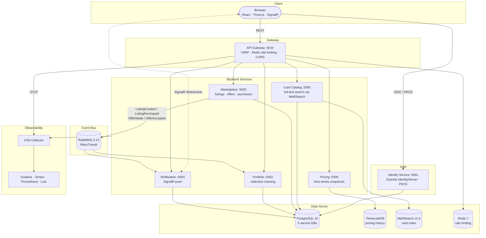

# Rollout TCG Trading Platform

A microservices platform for trading physical TCG cards — portfolio tracking, marketplace listings, real-time pricing, and OAuth2-secured APIs, with a holographic React frontend.

**Stack:** .NET 10 · React 18 · PostgreSQL · RabbitMQ · MeiliSearch · TimescaleDB · full OTel observability

---

## Architecture



Each backend service is independently deployable, owns its own database schema, and communicates asynchronously via integration events over RabbitMQ. The API Gateway is the single entry point for the SPA; the Identity Service is accessed directly only for OIDC flows.

---

## Services

| Service | Port | Description |
|---|---|---|
| **Identity Service** | 5001 | OAuth2 / OIDC token issuance via Duende IdentityServer; user registration with ASP.NET Core Identity |
| **Portfolio** | 5002 | Collection item tracking — add, grade, and manage owned cards; listens for `ListingPurchasedEvent` to auto-add bought cards |
| **Marketplace** | 5003 | Create and manage card listings; accept offers; publishes `ListingCreated`, `ListingPurchased`, `OfferMade`, `OfferAccepted` events |
| **Notification** | 5004 | Persists notifications and delivers them in real time over a SignalR hub; consumes events from RabbitMQ |
| **Card Catalog** | 5005 | Card data seeded from the Pokémon TCG dataset; MeiliSearch-backed full-text and faceted search |
| **Pricing** | 5006 | Records and queries price snapshots in TimescaleDB; custom `ActivitySource` telemetry for pricing traces |
| **API Gateway** | 5010 | YARP reverse proxy — routes all SPA traffic to backend services; enforces Redis-backed rate limiting per client IP |

### Internal structure

Each service follows the same layout:

```
src/<Service>/
  Domain/          # Aggregates, entities, value objects, domain events
  Application/     # DTOs, repository interfaces
  Infrastructure/  # EF Core / Dapper persistence, MassTransit consumers, search
  Program.cs       # Minimal API endpoints
```

> Pricing uses Dapper + raw SQL over Npgsql instead of EF Core — better fit for time-series append-only writes into TimescaleDB.

---

## Frontend

```
src/Frontend/
  src/
    api/           # Axios client with injected Bearer token
    auth/          # oidc-client-ts hooks (PKCE flow)
    components/    # Navbar, DitherBackground, holographic card renderer
    pages/         # Cards, Portfolio, Marketplace, Notifications, Login, Callback
```

| Tech | Use |
|---|---|
| React 18 + TypeScript | App shell and pages |
| Vite | Build tooling |
| TailwindCSS | Utility-first styling, dark slate theme |
| Three.js + @react-three/fiber | Holographic card tilt / foil effect |
| framer-motion | Page and list animations |
| @tanstack/react-query | Server state, caching, background refetch |
| oidc-client-ts | OIDC / PKCE auth flow against Identity Service |
| @microsoft/signalr | Real-time notification hub connection |

The frontend is built to a static bundle and served by nginx in production (`src/Frontend/Dockerfile`).

---

## SharedKernel

A shared project reference (not a NuGet package) that all services depend on.

### Domain primitives

| Type | Purpose |
|---|---|
| `Entity` | Base with `Id: Guid` and `CreatedAt: DateTime` |
| `AggregateRoot : Entity` | Adds a `DomainEvents` collection; `PopDomainEvents()` is used by the transactional outbox |
| `IDomainEvent` | Marker interface for domain events |

### Integration events

| Event | Publisher | Consumers |
|---|---|---|
| `CardCatalogSyncedEvent` | Card Catalog | — |
| `CardPriceUpdatedEvent` | Pricing | — |
| `ListingCreatedEvent` | Marketplace | Notification |
| `ListingPurchasedEvent` | Marketplace | Notification, Portfolio |
| `OfferMadeEvent` | Marketplace | Notification |
| `OfferAcceptedEvent` | Marketplace | Notification |

### Infrastructure helpers

- **`AddTelemetry(serviceName)`** — one call wires Serilog → Loki, OTel traces → Tempo, Prometheus metrics exporter. Used in every service `Program.cs`.
- **Outbox** — `OutboxMessage`, `OutboxWorkerBase`, `IOutboxRepository` provide the transactional outbox pattern for reliable event dispatch.

---

## Infrastructure

All components run via Docker Compose.

| Component | Port | Purpose |
|---|---|---|
| PostgreSQL 16 | 5432 | Per-service databases: `db_identity`, `db_portfolio`, `db_marketplace`, `db_notification`, `db_cardcatalog` |
| TimescaleDB | 5433 | `db_pricing` — hypertable for price snapshots |
| RabbitMQ 3.13 | 5672 / 15672 | Integration event bus; management UI at `:15672` |
| Redis 7 | 6379 | API Gateway rate limiting |
| MeiliSearch v1.9 | 7700 | Card catalog full-text search index |
| OTel Collector | 4317 / 4318 | OTLP ingest from all services |
| Tempo | 3200 | Distributed trace storage |
| Prometheus | 9090 | Metrics scraping (each service exposes `/metrics`) |
| Loki | 3100 | Log aggregation (Serilog sink on all services) |
| Grafana | 3001 | Unified dashboard — traces, metrics, logs |

---

## Tech Stack

| Layer | Technology |
|---|---|
| Runtime | .NET 10 · C# 13 · ASP.NET Core Minimal APIs |
| Auth | Duende IdentityServer 7 · ASP.NET Core Identity |
| Messaging | MassTransit 8 + RabbitMQ 3.13 |
| ORM | EF Core 10 + Npgsql (5 services); Dapper + Npgsql (Pricing) |
| Search | MeiliSearch SDK 0.19 |
| Gateway | YARP 2.3 |
| Rate limiting | RedisRateLimiting.AspNetCore + StackExchange.Redis |
| Observability | OpenTelemetry SDK 1.16 · Serilog · Grafana (Tempo, Prometheus, Loki) |
| Testing | xUnit · FluentAssertions · NSubstitute · Testcontainers (Postgres, RabbitMQ, Redis, MeiliSearch) |
| Frontend | React 18 · TypeScript · Vite · Tailwind · Three.js · framer-motion |
| CI / CD | GitHub Actions — build/test on every push; Docker build + GHCR push on `main` |

---

## Quick Start

**Prerequisites:** Docker Desktop, .NET 10 SDK

```bash
# Start the full stack
docker compose up -d

# Add observability (Grafana, Tempo, Prometheus, Loki)
docker compose --profile observability up -d

# Confirm services are healthy
docker compose ps
```

### Local URLs

| URL | Service |
|---|---|
| **http://localhost** | Frontend SPA |
| **http://localhost:3001** | Grafana dashboards — Services Overview, Infrastructure, Traces *(observability profile)* |
| http://localhost:15672 | RabbitMQ management UI (guest / guest) |
| http://localhost:7700 | MeiliSearch dashboard |
| http://localhost:5001 | Identity Service (OIDC discovery at `/.well-known/openid-configuration`) |
| http://localhost:5010 | API Gateway |
| http://localhost:9090 | Prometheus *(observability profile)* |
| http://localhost:3100 | Loki *(observability profile)* |
| http://localhost:3200 | Tempo *(observability profile)* |

**Demo account** (pre-seeded): `demo@rollout.dev` / `Demo1234!`

```bash
# Quick smoke test
curl http://localhost:5001/.well-known/openid-configuration
curl "http://localhost:5005/cards/search?q=charizard"
```

**Register and get a token (dev only):**

```bash
curl -X POST http://localhost:5001/account/register \
  -H "Content-Type: application/json" \
  -d '{"userName":"ash","email":"ash@pokecenter.com","password":"Pikachu@1"}'

curl -X POST http://localhost:5001/connect/token \
  -d "grant_type=password&client_id=test-client&client_secret=test-secret&username=ash&password=Pikachu@1&scope=openid profile tcg.full"
```

> `test-client` (resource owner password grant) is dev-only — disabled in Production. The SPA uses the `spa` client with Authorization Code + PKCE.

### OAuth2 clients

| Client | Grant | Use |
|---|---|---|
| `spa` | Authorization Code + PKCE | Frontend SPA (no client secret) |
| `test-client` | Resource Owner Password | Integration tests and dev — disabled in Production |

API scope: `tcg.full`

---

## Development

```bash
# Build the whole solution
dotnet build TCGTrading.sln

# Run all tests (Testcontainers spins up real Postgres, RabbitMQ, Redis, MeiliSearch)
dotnet test TCGTrading.sln

# Run a single service locally (infrastructure must be running)
dotnet run --project src/Marketplace

# Frontend dev server
cd src/Frontend && npm install && npm run dev

# Docs site (MkDocs)
pip install -r requirements.txt
mkdocs serve        # live preview at http://127.0.0.1:8000
mkdocs build        # build to site/
```

---

## CI / CD

| Workflow | Trigger | What it does |
|---|---|---|
| `ci.yml` | Push to any branch, PR to `main` | `dotnet build` + `dotnet test` across the full solution |
| `docker.yml` | Push to `main` | Builds all 7 service images in parallel, pushes to GHCR (`ghcr.io/wanony/tcgtrading-*`); tagged `sha-<short>`, `main`, and `latest` |
| `docs.yml` | Push to `main` (docs paths) | Builds MkDocs site and deploys to GitHub Pages |

---

## Roadmap

- [ ] JWT validation in the API Gateway (currently trusts upstream services to validate tokens)
- [ ] SPA-side offer flow (UI exists for listings and portfolio; offer accept/reject is API-only today)
- [ ] Pricing poller — background worker that polls external TCG price APIs and publishes `CardPriceUpdatedEvent`
- [ ] Gamified pack opening (v2) — virtual credit purchases, rarity-weighted card pulls, animated reveal
