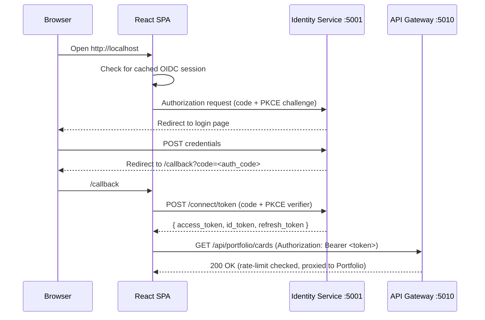

# Auth & Security

Authentication and authorisation are centralised in the Identity Service, which acts as an OpenID Connect / OAuth2 provider using Duende IdentityServer 7.

## Auth flow (SPA)



**PKCE** (Proof Key for Code Exchange) is used because SPAs cannot safely hold a client secret — they run in the browser where all code is visible. PKCE replaces the client secret with a one-time code verifier:

1. The SPA generates a random `code_verifier` and its `code_challenge` (SHA-256 hash).
2. The `code_challenge` is sent in the authorization request.
3. The auth code is exchanged for tokens by sending the `code_verifier` — only the holder of the original verifier can complete the exchange.

## OAuth2 clients

| Client | Grant | Use |
|---|---|---|
| `spa` | Authorization Code + PKCE | React SPA — no client secret |
| `test-client` | Resource Owner Password | Integration tests + local API testing only |

The `test-client` ROPC grant is convenient for scripted token fetches but is disabled in production. It should never be used in a browser.

## Scopes

| Scope | Purpose |
|---|---|
| `openid` | Required for OIDC — issues an `id_token` with `sub` claim |
| `profile` | User profile claims (name, etc.) |
| `email` | User email in the token |
| `tcg.full` | Custom API scope — full access to all TCG platform endpoints |

## JWT validation

The API Gateway validates JWT access tokens from IdentityServer using the public keys exposed at `http://identity-service:5001/.well-known/openid-configuration`. All services behind the gateway receive pre-validated tokens.

Currently the gateway forwards the `Authorization` header to downstream services without re-validating. Per-service JWT validation is a planned hardening step.

## IdentityServer signing credential

The development setup uses `AddDeveloperSigningCredential()`, which generates a signing key and persists it in `~/.aspnet/DataProtection-Keys/`. This key regenerates if the container is removed.

For production, replace this with a certificate stored in a secret manager (Azure Key Vault, AWS Secrets Manager, etc.):

```csharp
// Production pattern (not currently implemented)
builder.Services.AddIdentityServer()
    .AddSigningCredential(certificate); // loaded from Key Vault
```

## User registration

Users register via a form on the Identity Service itself at `/Account/Register` (ASP.NET Core Identity Razor Pages) or via the registration API endpoint:

```
POST http://localhost:5001/account/register
Content-Type: application/json

{ "userName": "ash", "email": "ash@pokecenter.com", "password": "Pikachu@1" }
```

Passwords are hashed with ASP.NET Core Identity's default PBKDF2 + HMACSHA512 scheme.
