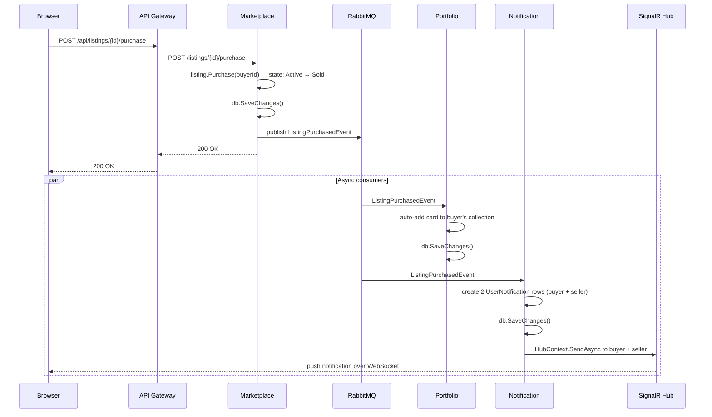

# Event Flow

Services communicate business side-effects through integration events published to RabbitMQ via MassTransit. Events are defined in SharedKernel so publishers and consumers share the same contract without a direct project reference to each other.

## Integration events

All events are immutable positional records:

```csharp
// src/SharedKernel/Contracts/
public record ListingCreatedEvent(
    Guid EventId, DateTime OccurredAt,
    Guid ListingId, Guid CardId, string CardName,
    Guid SellerId, decimal AskingPriceUsd, string Condition);

public record ListingPurchasedEvent(
    Guid EventId, DateTime OccurredAt,
    Guid ListingId, Guid CardId,
    Guid BuyerId, Guid SellerId, decimal PriceUsd);

public record OfferMadeEvent(
    Guid EventId, DateTime OccurredAt,
    Guid ListingId, Guid OfferId,
    Guid BuyerId, Guid SellerId, decimal OfferAmountUsd);

public record OfferAcceptedEvent(
    Guid EventId, DateTime OccurredAt,
    Guid ListingId, Guid OfferId,
    Guid BuyerId, Guid SellerId, decimal FinalPriceUsd);

public record CardCatalogSyncedEvent(Guid EventId, DateTime OccurredAt, int CardCount);
public record CardPriceUpdatedEvent(Guid EventId, DateTime OccurredAt, Guid CardId, decimal NewPriceUsd);
```

## Purchase flow

The most complex event chain is a listing purchase:



## MassTransit topology

MassTransit creates one exchange and one queue per consumer class in RabbitMQ. The publish side sends to the event type's exchange; each consumer's queue binds to it. This means adding a new consumer for an existing event requires zero changes to the publisher.

```
Exchange: TCGTrading.SharedKernel.Contracts:ListingPurchasedEvent
  → Queue: portfolio-listing-purchased-event  (Portfolio consumer)
  → Queue: notification-listing-purchased-event  (Notification consumer)
```

## Event delivery guarantees

In the current implementation, events are published directly within the HTTP request handler — there is no outbox. This means that if the broker is unavailable at publish time, the event is lost (though the database write has already succeeded).

The SharedKernel provides an `OutboxWorkerBase` and `OutboxMessage` base class for services that need at-least-once delivery. Wiring it up for Marketplace is a planned improvement — the outbox stores the serialised event in the same transaction as the domain write, then a background worker relays it to RabbitMQ.

!!! info "Outbox pattern"
    The transactional outbox solves the dual-write problem: you need to update your DB *and* publish an event atomically, but they're different systems. The outbox writes both in one DB transaction; the relay worker publishes and deletes the outbox row. If the relay fails, it retries — you get at-least-once delivery without distributed transactions.
