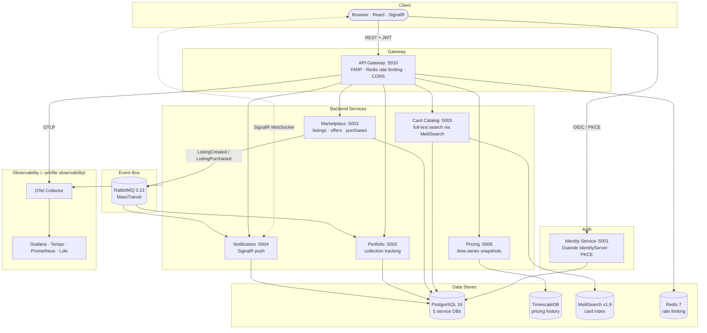

# Architecture Overview

Rollout TCG is structured as a collection of independently deployable microservices, each owning its own database schema and communicating asynchronously via integration events over RabbitMQ. The SPA talks to a single API Gateway — no service is directly reachable from the browser except the Identity Service (OIDC flows).

## System diagram



## Design principles

**Database-per-service** — Each service has its own isolated database (or schema). No service reads another's database directly. Cross-service data needs are fulfilled through integration events or API calls via the gateway. This makes each service independently deployable and allows different data technologies where appropriate (TimescaleDB for time-series, MeiliSearch for full-text search).

**Async event-driven communication** — Business side-effects that cross service boundaries are expressed as events published to RabbitMQ via MassTransit. When a listing is purchased, the Marketplace publishes a `ListingPurchasedEvent`; the Notification and Portfolio services independently consume it. Neither service knows about the other. Adding a new consumer doesn't require touching the publisher.

**Single entry point** — The API Gateway (YARP) is the only backend service the SPA talks to for API calls. This gives a central place to enforce rate limiting, CORS, and future JWT validation without duplicating that logic across services.

**OIDC / PKCE auth** — The SPA authenticates against Duende IdentityServer using the Authorization Code flow with PKCE — the browser-safe variant with no client secret. JWT access tokens are issued and presented to the API Gateway on every request.

**Full observability by default** — Every service exports OpenTelemetry traces, Prometheus metrics, and structured logs to a central OTel Collector via OTLP. A single `AddTelemetry(serviceName)` call in SharedKernel wires all three signals. Grafana correlates traces, metrics, and logs in one UI.

## Service responsibilities

| Service | Owns | Publishes | Consumes |
|---|---|---|---|
| **Identity** | Users, credentials, tokens | — | — |
| **Portfolio** | Collection items | — | `ListingPurchasedEvent` |
| **Marketplace** | Listings, offers | `ListingCreatedEvent`, `ListingPurchasedEvent`, `OfferMadeEvent`, `OfferAcceptedEvent` | — |
| **Notification** | User notifications | — | `ListingCreatedEvent`, `ListingPurchasedEvent`, `OfferMadeEvent`, `OfferAcceptedEvent` |
| **Card Catalog** | Card data, search index | — | — |
| **Pricing** | Price snapshots | — | — |
| **API Gateway** | Routing, rate limiting | — | — |

## Service internal structure

All .NET services follow clean architecture with three layers:

```
src/<Service>/
  Domain/          Aggregates, entities, value objects
  Application/     Use-case DTOs, repository interfaces (no infrastructure imports)
  Infrastructure/  EF Core / Dapper adapters, MassTransit consumers, search clients
  Program.cs       Minimal API endpoint declarations + DI composition root
```

The dependency rule flows inward: `Infrastructure` depends on `Application` depends on `Domain`. Nothing in `Domain` or `Application` imports an ORM, a message bus, or a search client — those details live in `Infrastructure`.

!!! note "Pricing exception"
    The Pricing service uses Dapper + raw SQL instead of EF Core. Time-series workloads (append-only writes, `time_bucket()` aggregation queries) benefit from direct SQL control rather than an ORM abstraction. The TimescaleDB hypertable extension is also easier to manage via raw DDL at startup.
