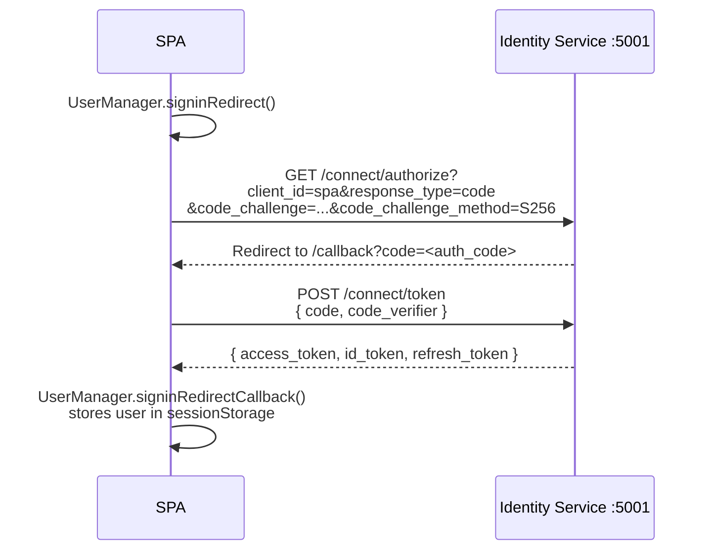

# Frontend Authentication

The SPA uses `oidc-client-ts` to implement the OAuth2 Authorization Code flow with PKCE against the Identity Service.

## Flow overview



## Configuration

```typescript
// src/auth/authConfig.ts
export const userManager = new UserManager({
  authority: 'http://localhost:5001',
  client_id: 'spa',
  redirect_uri: `${window.location.origin}/callback`,
  response_type: 'code',
  scope: 'openid profile email tcg.full',
  automaticSilentRenew: true,
})
```

`automaticSilentRenew` uses the refresh token to silently obtain a new access token before expiry, so users aren't kicked out during a session.

## AuthProvider

`AuthProvider.tsx` wraps the app and exposes authentication state via React context:

```typescript
const { user, login, logout, isLoading } = useAuth()

// user?.access_token   — Bearer token for API calls
// user?.profile.sub    — user ID (Guid string)
// user?.profile.email  — user email
```

After login, `setAuthToken(user.access_token)` is called to inject the token into the Axios instance. Every subsequent API call sends `Authorization: Bearer <token>` automatically.

## Protecting routes

```typescript
function RequireAuth({ children }: { children: ReactNode }) {
  const { user, isLoading, login } = useAuth()
  useEffect(() => { if (!isLoading && !user) login() }, [user, isLoading, login])
  if (isLoading || !user) return null
  return <>{children}</>
}

// In App.tsx
<Route path="/portfolio" element={<RequireAuth><PortfolioPage /></RequireAuth>} />
```

Unauthenticated users hitting a protected route are automatically redirected to the Identity Service login page.

## Callback page

After the Identity Service redirects back to `/callback`, `CallbackPage` completes the PKCE exchange:

```typescript
// src/pages/CallbackPage.tsx
useEffect(() => {
  userManager.signinRedirectCallback()
    .then(() => navigate('/cards'))
    .catch(console.error)
}, [])
```

## Token usage

The Axios client in `api/client.ts` has the Bearer token set via:

```typescript
export function setAuthToken(token: string | null) {
  if (token) {
    axiosInstance.defaults.headers.common['Authorization'] = `Bearer ${token}`
  } else {
    delete axiosInstance.defaults.headers.common['Authorization']
  }
}
```

The token is sourced from `user.access_token` provided by `oidc-client-ts` after successful authentication.
