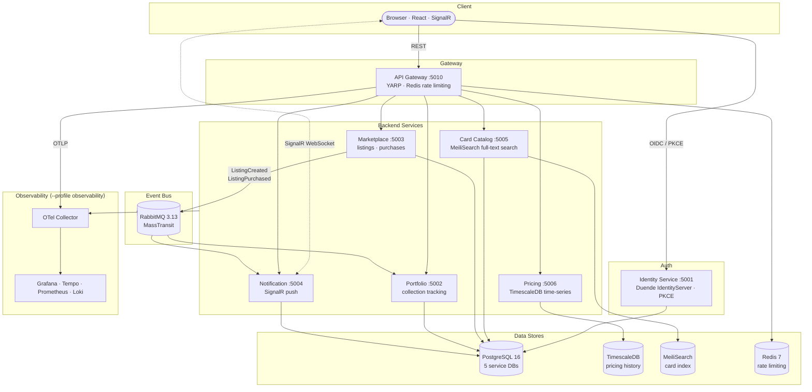

# Rollout TCG

**Rollout TCG** is a full-stack microservices platform for trading physical Trading Card Game cards. Users can build and track their card portfolio, buy and sell on a live marketplace, and receive real-time push notifications when their listings sell or offers are made. A holographic React frontend surfaces price history charts, type-driven card glow effects, and an OIDC-secured auth flow.

The project is purpose-built to demonstrate production-grade .NET microservices architecture — distributed tracing, event-driven messaging, full-text search, time-series data, rate limiting, and a CI/CD pipeline that pushes container images to GHCR on every merge to `main`.

---

## Quick Links

| What | Where |
|---|---|
| Run it locally | [Quick Start](getting-started/quick-start.md) |
| Develop locally | [Local Development](getting-started/development.md) |
| Try the demo account | [Demo Account](getting-started/demo.md) |
| Architecture diagram | [Architecture Overview](architecture/overview.md) |
| Grafana observability | [Observability](infrastructure/observability.md) |
| API endpoints | Each [service page](services/identity.md) has its own endpoint reference |

---

## Platform Overview

---

## Tech Stack at a Glance

| Layer | Technology |
|---|---|
| **Runtime** | .NET 10 · C# 13 · ASP.NET Core Minimal APIs |
| **Auth** | Duende IdentityServer 7 · ASP.NET Core Identity · PKCE |
| **Messaging** | MassTransit 8 + RabbitMQ 3.13 |
| **ORM** | EF Core 10 + Npgsql (5 services) · Dapper (Pricing) |
| **Search** | MeiliSearch 1.9 |
| **Gateway** | YARP 2.3 |
| **Rate Limiting** | RedisRateLimiting.AspNetCore + StackExchange.Redis |
| **Observability** | OpenTelemetry SDK · Serilog · Grafana / Tempo / Prometheus / Loki |
| **Frontend** | React 18 · TypeScript · Vite · Tailwind CSS · framer-motion |
| **CI / CD** | GitHub Actions → GHCR |
| **Testing** | xUnit · FluentAssertions · NSubstitute · Testcontainers |
