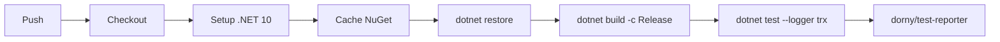

# CI / CD

Two GitHub Actions workflows handle continuous integration and container image publishing.

## Workflows

### ci.yml — Build & Test

**Triggers:** every push to any branch; every PR targeting `main`



The test step runs the full suite including Testcontainers-based integration tests. Testcontainers spins up real Docker containers (Postgres, RabbitMQ, Redis, MeiliSearch) on the GitHub Actions runner using the Docker-in-Docker socket.

Test results are published as a GitHub Checks report via `dorny/test-reporter` — visible inline on every PR.

NuGet packages are cached by `Directory.Packages.props` hash, so a lock-step version bump invalidates the cache.

### docker.yml — Docker Build & Push

**Triggers:** push to `main` only

Builds all 7 service images in parallel using a matrix strategy, then pushes to GitHub Container Registry (`ghcr.io`):

```
ghcr.io/wanony/tcgtrading-api-gateway
ghcr.io/wanony/tcgtrading-card-catalog
ghcr.io/wanony/tcgtrading-identity-service
ghcr.io/wanony/tcgtrading-marketplace
ghcr.io/wanony/tcgtrading-notification
ghcr.io/wanony/tcgtrading-portfolio
ghcr.io/wanony/tcgtrading-pricing
```

Each image is tagged with:
- `sha-<short-sha>` — immutable per-commit tag
- `main` — floating branch tag
- `latest` — always points to the most recent main build

The workflow uses `docker/build-push-action@v5` with GitHub Actions cache (`cache-from: type=gha`, `cache-to: type=gha,mode=max`) — unchanged layers are not rebuilt on subsequent pushes.

`fail-fast: false` on the matrix means a failure in one service doesn't cancel the others.

## Dockerfile pattern

Every service Dockerfile follows the same multi-stage pattern:

```dockerfile
# Stage 1: build
FROM mcr.microsoft.com/dotnet/sdk:10.0 AS build
WORKDIR /src

# Copy SharedKernel first (better layer caching — rarely changes)
COPY src/SharedKernel/ src/SharedKernel/
COPY Directory.Build.props Directory.Packages.props ./

# Copy service source
COPY src/Marketplace/ src/Marketplace/
RUN dotnet publish src/Marketplace/Marketplace.csproj -c Release -o /app

# Stage 2: runtime
FROM mcr.microsoft.com/dotnet/aspnet:10.0 AS final
WORKDIR /app
COPY --from=build /app .
ENTRYPOINT ["dotnet", "Marketplace.dll"]
```

Key constraints:
- Build context is always the **repo root** (`.`) — SharedKernel is a project reference, not a NuGet package, so the multi-stage build needs access to it
- SharedKernel is copied before service source to maximise Docker layer cache hits
- `TreatWarningsAsErrors=true` in `Directory.Build.props` — any warning fails the build

## Permissions

```yaml
permissions:
  contents: read
  packages: write   # required for ghcr.io push
```

`GITHUB_TOKEN` is used for ghcr.io authentication — no additional secrets are required.

## Local image build

```bash
# Build a single service image locally (run from repo root)
docker build -f src/Marketplace/Dockerfile -t tcgtrading-marketplace .
```
