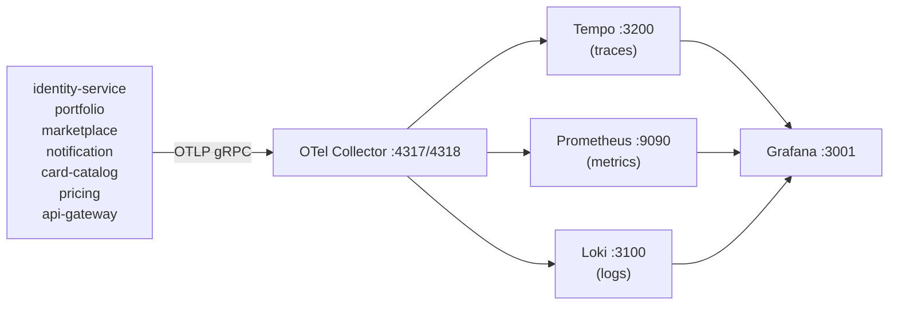

# Observability

The platform ships a full Grafana observability stack as an optional Docker Compose profile. Every service emits all three telemetry signals — traces, metrics, and structured logs — to a central OTel Collector which fans them out to the appropriate backend.

## Starting the observability stack

```bash
docker compose --profile observability up -d
```

Then open **[http://localhost:3001](http://localhost:3001)** — Grafana is pre-configured with no login required (anonymous admin mode for local dev).

## Architecture



### Signal routing

| Signal | From | To | Protocol |
|---|---|---|---|
| Traces | All services | Tempo | OTLP/gRPC → Collector |
| Metrics | All services (+ `/metrics` scrape) | Prometheus | OTLP/gRPC → Collector + Prometheus pull |
| Logs | All services | Loki | Serilog GrafanaLoki sink → Collector |

## Grafana dashboards

Three dashboards are provisioned automatically from `infra/grafana/dashboards/`:

### Services Overview
- Request rate (req/s) per service
- P95 / P99 latency per service
- Error rate per service
- Active connections

### Infrastructure
- PostgreSQL query rate and connection pool utilisation
- RabbitMQ queue depth and message rate
- Redis memory usage and command rate
- .NET runtime metrics (GC collections, heap size, thread pool queue length)

### Traces
- Live trace search by service name, operation, status, or trace ID
- Trace waterfall view with span details
- Click any trace to jump to correlated Loki logs via the TraceID derived field

## Datasource correlation

Grafana Tempo is configured to link traces to logs:

```yaml
# infra/grafana/provisioning/datasources/datasources.yaml
- name: Tempo
  jsonData:
    tracesToLogsV2:
      datasourceUid: loki
      filterByTraceID: true

- name: Loki
  jsonData:
    derivedFields:
      - name: TraceID
        matcherRegex: '"TraceId":"([0-9a-f]{32})"'
        url: '$${__value.raw}'
        datasourceUid: tempo
```

This means:
- In a trace view → click "View Logs" to jump to the Loki log lines for that trace
- In a Loki log line containing a `TraceId` field → click the link to jump to the Tempo trace

## What each service instruments

All services call `builder.AddTelemetry(serviceName)` from SharedKernel, which wires:

- **Serilog** — structured JSON console output + Loki sink; log lines are enriched with `TraceId` and `SpanId` from the active OTel span
- **OTel traces** — automatic instrumentation for HttpClient, EF Core, and MassTransit; custom spans added manually in Pricing service
- **OTel metrics** — ASP.NET Core request metrics, HttpClient metrics, .NET runtime metrics

Then each service adds its own ASP.NET Core instrumentation and Prometheus scrape endpoint:

```csharp
builder.Services.AddOpenTelemetry()
    .WithTracing(t => t.AddAspNetCoreInstrumentation())
    .WithMetrics(m => m
        .AddAspNetCoreInstrumentation()
        .AddPrometheusExporter());

app.MapPrometheusScrapingEndpoint(); // GET /metrics
```

## Grafana authentication

Grafana runs in anonymous admin mode for local development — no login required:

```yaml
environment:
  GF_AUTH_ANONYMOUS_ENABLED: "true"
  GF_AUTH_ANONYMOUS_ORG_ROLE: Admin
  GF_AUTH_DISABLE_LOGIN_FORM: "true"
```

For production, remove these settings and configure LDAP/SSO or a Grafana admin account.

## Common queries

### Find slow requests (Tempo)

```
{ resource.service.name="marketplace" } | duration > 500ms
```

### Error logs across all services (Loki)

```logql
{app="tcgtrading"} |= "level\":\"Error\""
```

### Request rate per service (Prometheus)

```promql
sum by (service_name) (rate(http_server_request_duration_seconds_count[1m]))
```
