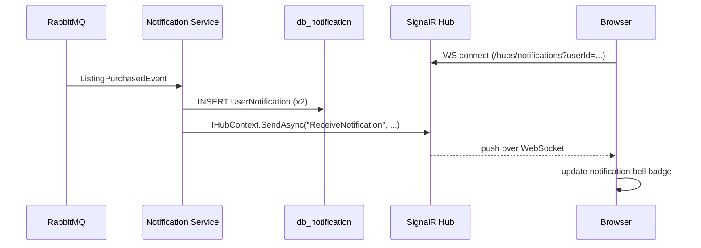

# Notification Service

**Port:** 5004  
**Database:** `db_notification` (PostgreSQL)  
**Technology:** EF Core 10 + Npgsql, MassTransit (consumer), ASP.NET Core SignalR

The Notification Service bridges the event bus and the browser. It consumes integration events from RabbitMQ, persists them as `UserNotification` rows, and pushes them to connected browser clients over a SignalR WebSocket connection in real time.

## Domain model

```
UserNotification (Entity)
  Id: Guid
  UserId: Guid
  Title: string
  Body: string
  IsRead: bool
  CreatedAt: DateTime
```

## Endpoints

| Method | Path | Description |
|---|---|---|
| `GET` | `/notifications?userId={guid}` | Fetch all notifications for a user |
| `POST` | `/notifications/{id}/read` | Mark a notification as read |
| `GET` | `/health` | Health check |
| WS | `/hubs/notifications?userId={guid}` | SignalR hub connection |

## Event consumers

### ListingPurchasedConsumer

When a listing is purchased, the Notification Service creates two notifications — one for the buyer, one for the seller:

```csharp
public async Task Consume(ConsumeContext<ListingPurchasedEvent> context)
{
    var ev = context.Message;

    var buyerNote = UserNotification.Create(
        ev.BuyerId, "Purchase complete",
        $"You bought {ev.CardName} for ${ev.PriceUsd:F2}");

    var sellerNote = UserNotification.Create(
        ev.SellerId, "Your listing sold",
        $"{ev.CardName} sold for ${ev.PriceUsd:F2}");

    await _repo.AddRangeAsync([buyerNote, sellerNote], ct);
    await _hubContext.Clients.User(ev.BuyerId.ToString()).SendAsync("ReceiveNotification", buyerNote);
    await _hubContext.Clients.User(ev.SellerId.ToString()).SendAsync("ReceiveNotification", sellerNote);
}
```

Similar consumers exist for `ListingCreatedEvent`, `OfferMadeEvent`, and `OfferAcceptedEvent`.

## SignalR hub

```
WebSocket: ws://localhost:5004/hubs/notifications?userId={userId}
```

The `userId` query parameter is used by `UserIdProvider` to map the WebSocket connection to a user identity. This avoids needing JWT middleware in the Notification Service for v1 — the gateway strips the auth header before proxying WebSocket upgrades.

The hub sends a single event name to clients:

| Event | Payload |
|---|---|
| `ReceiveNotification` | `{ id, userId, title, body, isRead, createdAt }` |

## Real-time flow



## Testing

`tests/Notification.Tests/` covers the MassTransit consumers with NSubstitute mocks for the hub context, and integration tests with `Testcontainers.PostgreSql` + `Testcontainers.RabbitMq`.
